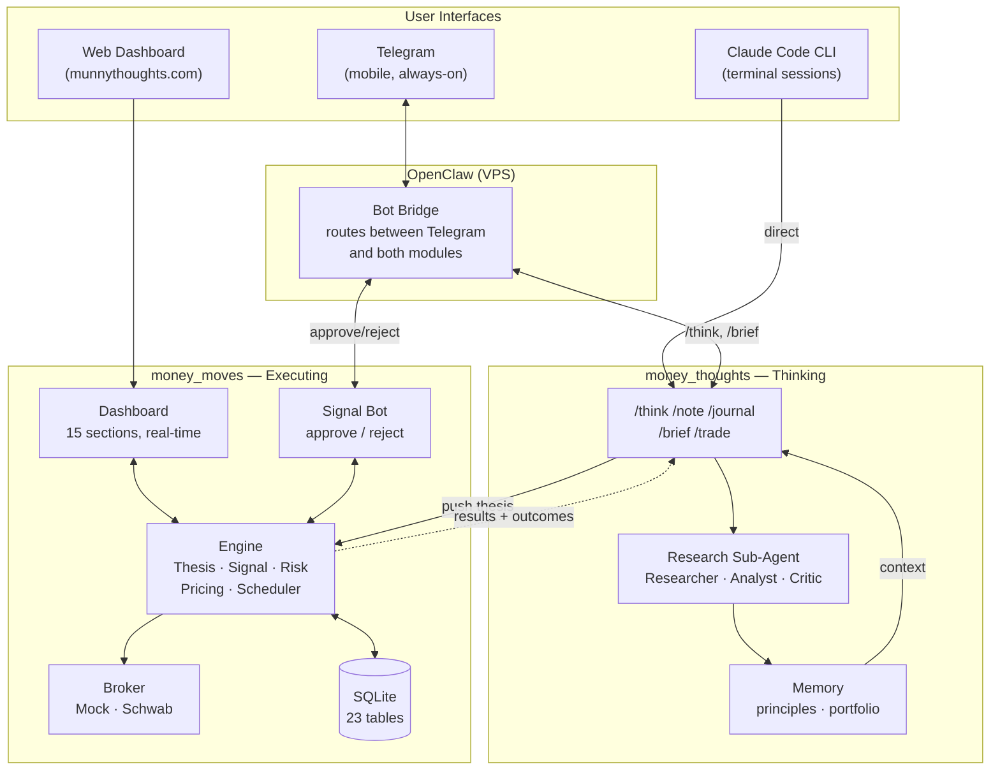

# Money System

Two-module AI-driven investment system: **money_thoughts** (thesis development) + **money_moves** (autonomous execution).

## How It Connects



### Which interface does what?

| Interface         | Reaches                   | What you do there                                                      |
| ----------------- | ------------------------- | ---------------------------------------------------------------------- |
| **Telegram**      | Both modules via OpenClaw | Research (`/think`), daily briefing (`/brief`), approve/reject signals |
| **Web Dashboard** | money_moves               | View portfolio, positions, theses, performance, risk — read-only       |
| **CLI**           | money_thoughts directly   | Development sessions, deep research, debugging                         |

### Data flow

1. **Think** — Develop thesis conversationally via `/think` (Telegram or CLI)
2. **Push** — Validated thesis pushed to money_moves via API
3. **Signal** — Gate checks pass → signal sent to Telegram with approve/reject buttons
4. **Execute** — Approved signal → broker executes trade
5. **Learn** — Outcomes feed back to money_thoughts, principles updated

## Quick Start

```bash
# Dashboard
cd moves && python3 -m venv .venv && source .venv/bin/activate
pip install -r requirements.txt && python3 run.py
# → http://localhost:8000

# Tests
cd moves && ./run_tests.sh
cd thoughts && python3 -m pytest
```

## Documentation

| File                        | Purpose                                |
| --------------------------- | -------------------------------------- |
| `CLAUDE.md`                 | System architecture + coding standards |
| `moves/CLAUDE.md`           | Execution engine — module docs         |
| `moves/spec/money_moves.md` | Design decisions (high-level)          |
| `moves/spec/clawdbot.md`    | OpenClaw deployment guide              |
| `thoughts/CLAUDE.md`        | Thinking engine — module docs          |
| `thoughts/AGENT_PROMPT.md`  | Sub-agent system prompt                |

---

*Evolved from `money_journal/` — the original research system.*
